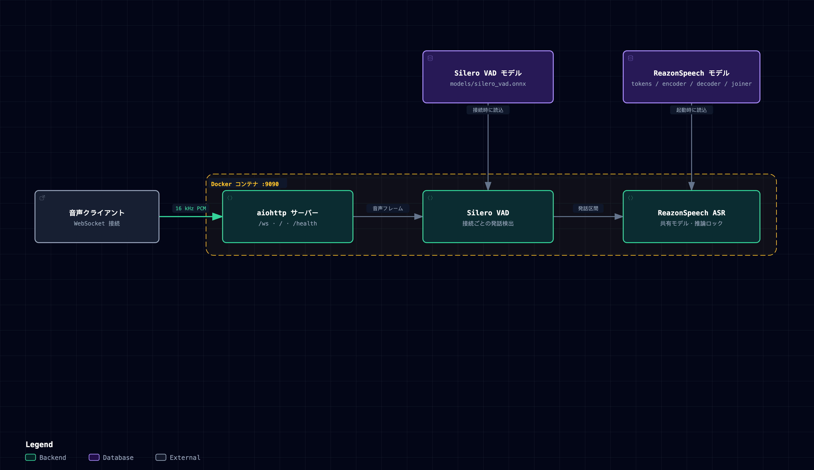

# ReazonSpeech WebSocket STT Server

`reazon-research/reazonspeech-k2-v2` を使って、16 kHz / mono / little-endian float32 PCM を発話単位で認識するWebSocket STTサーバーです。接続時に `SERVER_READY`、発話の認識後に `completed: true` のセグメントを返します。

## 利用モデルと出典

音声の文字起こしには、Reazon Human Interaction Lab の [ReazonSpeech プロジェクト](https://research.reazon.jp/projects/ReazonSpeech/index.html)で公開されている日本語音声認識モデル [reazonspeech-k2-v2](https://huggingface.co/reazon-research/reazonspeech-k2-v2) を使用しています。起動手順で取得する ONNX ファイルがこのモデルの本体です。発話区間の検出には、別のモデルである Silero VAD を使用します。

ReazonSpeech の公式ページでは、音声認識モデルのライセンスを Apache-2.0 と案内しています。モデルの詳細と利用条件は、上記の公式ページとモデルカードを確認してください。このリポジトリは、公開モデルを利用する独立した WebSocket サーバー実装です。

## アーキテクチャ



モデルはホストからコンテナの `/models` へ読み取り専用でマウントします。認識後は同じWebSocket接続で確定セグメントを返します。構成の詳細は、リポジトリをクローンした後に [HTML 版のアーキテクチャ図](docs/architecture.html) をブラウザで開いて確認できます。

## 起動

モデルは起動前にホスト側へダウンロードします。コンテナは `/models` を読み取り専用で参照し、起動時にネットワークからモデルを取得しません。ASRファイルが不足するとサーバー起動時に、VADファイルが不足するとWebSocket接続時にエラーになります。

```bash
# Hugging Face Hub CLI を仮想環境へ用意（プロジェクトと同じバージョン）
python3 -m venv .venv
. .venv/bin/activate
python -m pip install huggingface-hub==2.0.0
mkdir -p models

# ReazonSpeech ASR（既定の MODEL_PRECISION=int8）
HF_HUB_DISABLE_XET=1 HF_HOME="$PWD/models" hf download reazon-research/reazonspeech-k2-v2 \
  tokens.txt \
  encoder-epoch-99-avg-1.int8.onnx \
  decoder-epoch-99-avg-1.int8.onnx \
  joiner-epoch-99-avg-1.int8.onnx

# Silero VAD
curl -fL https://github.com/k2-fsa/sherpa-onnx/releases/download/asr-models/silero_vad.onnx \
  -o models/silero_vad.onnx

# 全ファイルが揃ったら起動
docker compose up -d --build
docker compose logs -f
```

`MODEL_PRECISION` を変更する場合は、設定に合わせたASRファイルを事前に取得してください。`fp32` は encoder / decoder / joiner の `.onnx`、`int8-fp32` は int8 encoder / joiner と fp32 decoder を使います。`tokens.txt` は共通です。たとえば `fp32` の場合:

```bash
HF_HUB_DISABLE_XET=1 HF_HOME="$PWD/models" hf download reazon-research/reazonspeech-k2-v2 \
  tokens.txt \
  encoder-epoch-99-avg-1.onnx \
  decoder-epoch-99-avg-1.onnx \
  joiner-epoch-99-avg-1.onnx
```

ログに `モデルロード完了` と `WebSocket server started` が出てからヘルス確認してください:

```bash
curl http://localhost:9090/health
# {"status":"ok","model":"reazonspeech-k2-v2"}
```

同じComposeネットワーク上のクライアントからは `reazonspeech-server:9090`、ホスト上のクライアントからは `localhost:9090` に接続できます。既定ではホストの `127.0.0.1` にだけポートを公開します。`STT_PORT` を変えた場合は、そのポートに読み替えてください。

別のホストから利用する場合は、TLS（`wss://`）、アクセス制御、接続数と送信量の制限を備えたリバースプロキシを前段に置いてください。プロキシから別ホストの本サーバーへ接続する必要がある場合だけ、`STT_BIND_ADDRESS` を到達可能なインターフェースのアドレスに変更し、ファイアウォールでプロキシからの接続に制限してください。このサーバー自体に認証機能はありません。音声データを扱うため、認証なしでインターネットへ直接公開しないでください。

## WebSocketプロトコル

接続先は `ws://<host>:<port>/` または `ws://<host>:<port>/ws` です。接続直後に、初期化JSONを送ります。

```json
{"uid":"client-1","task":"transcribe"}
```

初期化後、次の応答が返ります。

```json
{"uid":"client-1","message":"SERVER_READY","backend":"reazonspeech-k2-v2"}
```

以後は16 kHz / mono / float32 / little-endian PCMをbinary frameで送信します。Silero VADが発話終了を検出すると、次の確定セグメントを返します。partialは返しません。

```json
{"uid":"client-1","segments":[{"text":"音声を認識しました","completed":true,"start":12.5,"end":17.2}]}
```

複数のクライアントから同時に接続できます。各接続のVADとサンプルバッファは独立し、ASRモデルは起動時に一度だけロードして共有します。推論は共有ロックで直列化しています。現在、初期化JSONでは `task` に `transcribe` のみ指定できます。`uid` は応答にそのまま返されます。

## 設定

`.env.example` を参考に `.env` を作成します。

| 変数 | 既定値 | 内容 |
| --- | --- | --- |
| `STT_BIND_ADDRESS` | `127.0.0.1` | ホスト側の待受アドレス |
| `STT_PORT` | `9090` | ホストに公開するポート |
| `MODEL_PRECISION` | `int8` | `int8` / `fp32` / `int8-fp32` |
| `NUM_THREADS` | `2` | 推論スレッド数 |
| `VAD_THRESHOLD` | `0.5` | Silero VADしきい値 |
| `VAD_MIN_SPEECH_MS` | `250` | 発話とする最小時間 |
| `VAD_MIN_SILENCE_MS` | `500` | 発話終了とする無音時間 |
| `VAD_MAX_SPEECH_SECONDS` | `30` | 1発話の最大時間 |

## テスト

Python 3.11以降で依存を入れて実行します。

```bash
python -m venv .venv
. .venv/bin/activate
pip install -r requirements-dev.txt
python -m unittest discover -s tests -v
```

テストはWebSocket/HTTPの公開境界を通してREADY、完了応答、2接続の状態分離、不正PCMのエラー応答を確認します。実モデルの音声認識品質と長時間運転はローカルテストでは確認していません。運用前に実音声での認識と必要な運転時間を確認してください。
